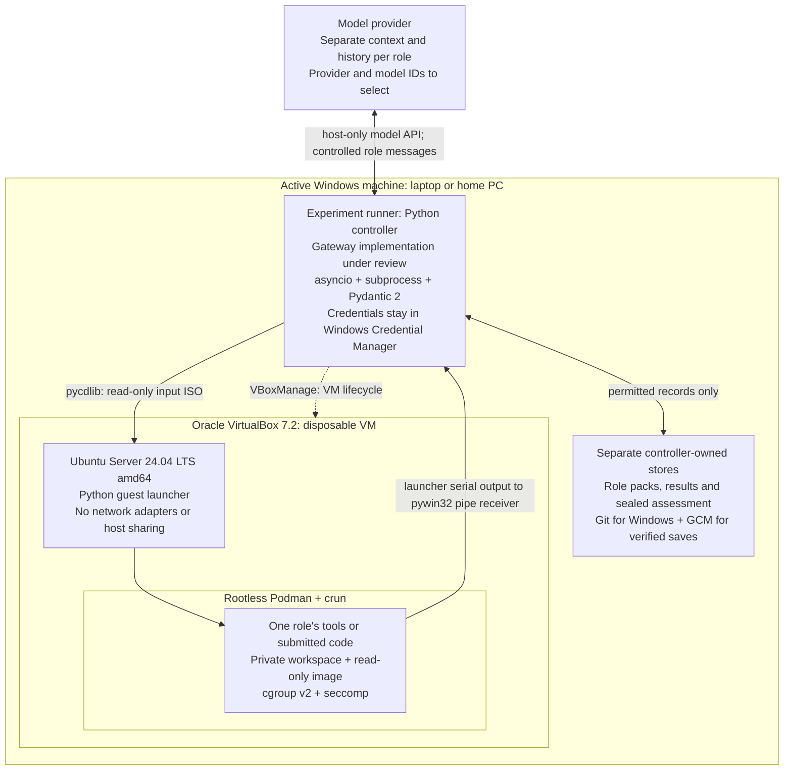
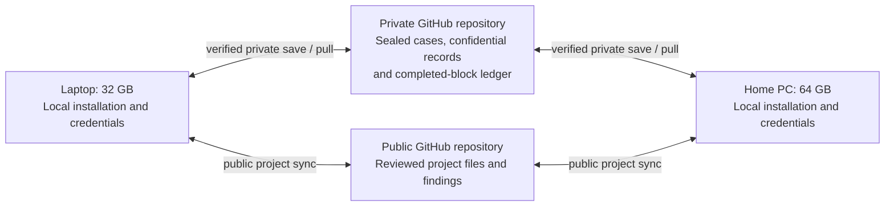

# Isolated runner and two-machine execution

Design version: **0.1 — 9 September 2026**. Implements the planning detail for sections 8–8C of the working plan. This is a proposed implementation, not an installed or qualified runner. The working plan takes precedence on research methods.

## Design decision

Either Windows machine should be able to run an experiment locally. The laptop has 32 GB RAM; the home PC has 64 GB and is not permanently on. Use the laptop as the common resource baseline and run one worker VM at a time. Switching machines means continuing from saved, completed work, not moving a running VM or depending on the home PC being available.

Use **VirtualBox, Ubuntu Server 24.04 LTS amd64 and rootless Podman** as the working stack. Python on Windows coordinates execution and model access. Containers hold tools and generated code; the models themselves run through a separately selected provider API. Each model role receives a fresh, explicitly constructed context.

The laptop runs Windows 11 Home, so the design cannot assume the Windows Hyper-V role, which [Microsoft does not provide on Home](https://learn.microsoft.com/en-us/windows-server/virtualization/hyper-v/get-started/install-hyper-v). [VirtualBox supports Windows 11 x86-64 hosts](https://docs.oracle.com/en/virtualization/virtualbox/7.2/user/installation.html). Its compatibility and performance with this laptop's active Windows hypervisor and Insider build must still be demonstrated. Do not disable Windows security features to make it work. Check the home PC's edition, architecture and virtualisation support separately. If either host cannot support the proposed boundary, revisit the design before running experiments there.

## Process overview

The **experiment runner** is the Python controller on the active Windows machine. It supplies permitted inputs, dispatches tools, enforces reviews and stops, and retains the record. The process has two connected activities, followed by independent assessment; preparing guidance is not repeated inside every coding step.

### Preparation: establish the guide before task work

The runner gives the drafter its permitted project evidence. A separate verifier checks the proposed claims. Admitted claims form a versioned, frozen guide; this is evidence-based verification without project-owner certification. GUIDE and INTERACT receive the same guide for the declared reuse set. DIRECT receives the permitted sources and applicable project instructions. The drafter and verifier do not receive the later task or historical target solution.

### Task use: repeat for each task and comparison group

Start a fresh coder context and submit a plan for review. Once permitted, execute a bounded tool/code batch in a fresh restricted environment, collect its results and close that environment. Required checkpoints and material plan changes return the attempt to review. INTERACT adds targeted questions about the guidance; every group follows the matched review policy and resource limits. Continue until completion or a terminal stop, carrying forward only each role's permitted history and validated files. The guide remains frozen throughout task use.

### Independent assessment and saving

After an attempt stops, separate assessment roles examine code and review decisions. The frozen guide is assessed independently of its verifier. Assess task correctness and guardrail compliance using the same criteria for historical and agent implementations. Hidden assessment feedback stays outside working-agent contexts. Retain failed and unfinished attempts and their costs. Complete a matched DIRECT/GUIDE/INTERACT block on one host and verify its private save before switching machines.

## Where the containers run

```text
Windows laptop or home PC
├─ Experiment runner
│  └─ Python controller
└─ VirtualBox
   └─ Ubuntu VM (offline)
      └─ Podman container
         └─ Tools or code
```

One worker container runs inside one VM at a time. Every tool batch gets a fresh VM and container. Assessment code uses a separate fresh environment. Models run at the provider; the runner on Windows manages their separate role contexts. The following diagrams add the permitted input/output and machine-switching connections to this tree.

## Deployment diagram

The same layout is installed independently on each machine. Only one machine executes a complete comparison block at a time. The diagram shows access boundaries and interfaces; it is not a single drafting, usage and approval workflow.



The output arrow includes the guest launcher and Windows named-pipe receiver: code in the container cannot access the serial device directly. The receiver applies byte, schema, path and state checks before results enter the controller. GitHub is reached only by trusted host code, as shown separately below.



**Read the nesting literally:** generated code runs inside a container, inside a disposable Linux VM. Model conversations run at the provider, outside that VM; the host controller controls their separate inputs and tool access. The guest has only the declared ISO and serial interfaces. Private GitHub storage is not mounted into it. Role-specific packs may contain only the assessment material that role is allowed to see.

After an attempt ends, the controller constructs separate anonymised assessment inputs. Evaluation code uses a new guest; no judge feedback or hidden-test result is sent back to working agents. On switching machines, verified public/private commits and exact environment manifests travel; active VM state and credentials do not.

## Product and tool selections

The [playbook's platform guidance](https://yspbob.github.io/AI-Playbook/AI_Engineering_Playbook.html#2-infrastructure-platform) recommends existing products for common capabilities. Before building custom gateway, evaluation or tracing infrastructure, compare LiteLLM / Portkey, Promptfoo and Langfuse with the POC's requirements. Record each adoption or departure against role isolation, sealed-data handling, enforced stops, matched budgets, audit export, resource footprint and two-machine continuity. This review is pending; no candidate is adopted here. `asyncio` and `subprocess` are low-level utilities for coordination and VM invocation, not substitutes for these platform products.

These are the named tools for the proposed implementation. The selection does not mean the software is installed or the control has passed testing. Exact patch versions, package hashes and image digests must be locked during provisioning; do not substitute a floating `latest` image for that record.

| Location / job | Product, library or command to use | Concrete responsibility |
|---|---|---|
| Windows controller | **CPython 3.12**, standard-library **asyncio**, **subprocess**, **json**, **hashlib** and **unittest** | Explicit state machine, fixed-argument process invocation, bounded record collection, SHA-256 manifests and controller regression tests. Limit custom code to justified experiment-specific coordination after the playbook tooling review. |
| Record schemas | **Pydantic 2** | Use strict field types and `extra="forbid"`. Reject duplicate JSON keys and enforce raw frame size before schema validation; enforce role/state/path rules separately. No schema library establishes containment or semantic correctness. |
| Outer boundary | **Oracle VirtualBox 7.2** and **VBoxManage** | Prepare the golden guest; clone, configure, start, inspect and stop disposable VMs. Explicitly disable guest network adapters and host integration. |
| Guest | **Ubuntu Server 24.04 LTS amd64** with its pinned kernel and package set | Minimal offline Linux base. A project-specific Python launcher receives the job and owns the serial endpoint; workload containers cannot access that device. |
| Containers | **Podman**, rootless, with **crun** explicitly selected as the OCI runtime | Build images during preparation, load pinned images offline and create fresh restricted containers. Record the actual Podman/crun package versions; no Docker daemon or runtime socket is exposed. |
| Linux enforcement | **cgroup v2**, **seccomp**, user namespaces and a delegated **systemd** user scope | Enforce CPU/memory/process caps and restricted system calls. Verify actual delegation and denials on the guest; fail if rootless resource enforcement is unavailable. |
| Input images | **pycdlib**; VirtualBox read-only optical media | Build ISO9660 job images from permitted regular files and attach them before guest startup. No shared host folder is needed. |
| Output transport | VirtualBox **virtual serial Host Pipe**, Windows **named pipes**, **pywin32** (`win32pipe`, `win32file`, `win32security`) | Create an account-restricted endpoint, receive bounded JSON frames and validate results before storing them. Test access controls, cancellation, malformed frames and floods. |
| Model access | Controlled gateway; **LiteLLM / Portkey to assess; provider, model IDs and adapter still to select** | Send only role-specific histories and permitted inputs; record usage and reject unapproved tools/destinations. Select the external service after checking access, retention, model suitability and the authorised budget. This choice is not needed for the first model-free runner. |
| Code assessment | Pinned project tests plus **Python** case probes; H04 uses **HTTPX MockTransport** and custom assertions | Run deterministic behavioural observations in the isolated guest. Use separately qualified model contexts for judgements requiring interpretation. These are different from controller regression tests. |
| Git and records | **Git for Windows**, **GitHub**, **Git Credential Manager (GCM)**; JSON and SHA-256 | Public project history and separate private confidential records. The controller invokes Git; the guest does not. The private repository name and access have not yet been configured. |
| Local credentials | **Windows Credential Manager**; GCM for Git and **pywin32 `win32cred`** for model secrets | Retrieve credentials only in trusted host code. Do not put secrets in job ISOs, Git, command arguments, logs or guest environment variables. |

The product capabilities are documented by [Pydantic strict mode](https://docs.pydantic.dev/latest/concepts/strict_mode/) and [configuration](https://docs.pydantic.dev/latest/api/config/), [pywin32](https://pypi.org/project/pywin32/), [its named-pipe API](https://github.com/mhammond/pywin32/blob/main/win32/src/win32pipe.i), [its credential API](https://github.com/mhammond/pywin32/blob/main/win32/src/win32credmodule.cpp), [Podman](https://docs.podman.io/en/latest/markdown/podman.1.html), [crun](https://github.com/containers/crun/blob/main/crun.1.md) and [GCM's credential-store configuration](https://github.com/git-ecosystem/git-credential-manager/blob/main/docs/configuration.md). These sources support the capabilities used in the design; they do not validate their combination here.

Version families are design choices. Before provisioning, select maintained patch releases and record download provenance and checksums. Before execution, lock the installed versions, guest disk and OCI image digests, controller commit, protocol and configuration hash. An unfilled digest is a failed readiness gate. Do not claim independently rebuilt disks are identical without comparing them.

## What the boundary must protect

Assume generated commands and code, repository instructions, dependencies and returned artifacts may be hostile. Protect personal host files, credentials, the controller, other roles and runs, and withheld assessment material. Include resource exhaustion and misleading output in the threat model. Other authorised host applications and an already compromised Windows administrator account are outside this experiment's isolation claim.

The trusted components include Windows, the hypervisor, controller and output parser, guest launcher, model gateway and independent assessment path. Container escape into the guest is a tested threat; the VM is an additional boundary. A hypervisor or host parser vulnerability remains a possible route beyond it. The result can establish resistance to specified tested paths, not absolute absence of escape routes or prior model knowledge.

## Isolate agent roles as well as code

Each drafter, verifier, coder, reviewer/checker and independent assessor has its own model context and tool workspace. A separate prompt inside an existing conversation is insufficient. Create fresh provider sessions or explicitly assembled request histories, scoped to the role, run and treatment. Do not reuse provider conversation IDs, writable file stores, retrieval indexes, agent memory, browser sessions or tool sessions between roles or attempts. Disable provider-hosted execution, browsing, connectors and retrieval unless a later reviewed design can impose the same boundaries. No experimental role runs inside the investigator's Codex conversation.

| Boundary | Allowed exchange | Material kept out |
|---|---|---|
| Preparation to verification | Permitted project evidence plus proposed claims | Downstream task, historical target implementation and assessment answers |
| Frozen preparation to task work | The same admitted guide for GUIDE and INTERACT; ordinary sources/instructions for every group | Rejected claims, private preparation history and investigator notes unless explicitly part of the frozen treatment |
| Coder to reviewer/checker | Submitted plan, changes and permitted observations through the controller | Private coder reasoning, unrelated role histories and hidden assessment data |
| Reviewer/checker to coder | Bounded decision, reasons and permitted correction questions | Arbitrary tools, direct role addressing or extra evidence outside that treatment's permissions |
| Terminal attempt to assessment | The role-specific anonymised submission, criteria and independently collected observations | No resulting scores or withheld-test feedback return to the stopped attempt or later blind roles |

The controller chooses the destination and constructs each payload from an allowlist. Agent-supplied role names, paths or requests cannot expand it. Review messages are a deliberately permitted information channel; valid JSON does not establish their semantic safety. Test attempts to smuggle excluded evidence, invent authority or cause the recipient to request forbidden tools. Mechanical access controls constrain capabilities even if a receiving model follows malicious text.

The host's private repository is investigator storage, never a role's working directory or a mounted volume. There is no shared writable role cache even inside a VM. Every tool batch uses a fresh guest; any persisted context or workspace is separately keyed to its owning role and attempt. A reviewer may receive a submitted code snapshot to review, but cannot mutate the coder's workspace. Assessment execution uses a separate fresh guest with only the selected test material, never the full answer store. Secret markers in prohibited packs, forged role IDs and stale session handles must be used in model-free dispatch tests to demonstrate that the controller cannot expose them through its designed interfaces. Later authorised model probes test how roles handle malicious permitted messages.

These controls address runtime and context leakage. Public-project training knowledge and provider-side data handling are separate limitations; neither a container nor a fresh API request establishes their absence. Provider retention, session isolation and enabled tool behaviour must be checked when selecting the API/SDK, before sending sealed material.

## Prepare once, execute offline

Build a clean guest with public operating-system packages, tools and pinned case dependencies. Network access is permitted only in this preparation state, before any sealed inputs or experimental workload are present. Remove provisioning credentials, shut down, disable every virtual network adapter and record the baseline. Workload-used guests are never reconnected for package installation; rebuild a clean baseline when dependencies change.

No shared host folders, clipboard, drag and drop, Guest Additions, USB passthrough, remote display service or unnecessary virtual devices are part of the execution profile. No NAT, bridged, host-only or internal network is allowed. Oracle documents both [VM device and serial-port configuration](https://docs.oracle.com/en/virtualization/virtualbox/7.2/user/working-with-vms.html) and [network modes](https://docs.oracle.com/en/virtualization/virtualbox/7.2/user/networkingdetails.html); these capabilities must be inspected in the realised configuration, not assumed from a template.

Inside the guest, the launch profile uses a non-root user, rootless Podman, no networking, all capabilities dropped, no new privileges, a read-only image, a bounded writable workspace and temporary storage, and retained seccomp protection. Use `--network=none`, `--cap-drop=all`, `--security-opt=no-new-privileges`, `--read-only` and `--pull=never`, with explicit mounts and limits validated against the installed version. [Podman documents these controls and resource-limit restrictions](https://docs.podman.io/en/latest/markdown/podman-run.1.html). Do not expose runtime sockets, host namespaces or guest devices to the container. Verify enforcement through cgroup v2; accepting a flag is insufficient.

The initial **model-free smoke-test profile** is one VM with 4 virtual CPUs and 8 GiB RAM, containing one worker limited to 2 CPUs and 4 GiB RAM. Start with a 1 GiB writable workspace, 256 MiB temporary storage, 128 container processes and a 120-second tool-batch deadline. Reserve enough free host memory and disk for the VM and bounded output before launch. These are test settings to measure, not validated capacity estimates or frozen experimental budgets. Larger cases require a reviewed common profile that also works on the laptop.

## One bounded tool batch

1. The controller verifies the role, checkpoint permission, remaining allowance, input manifest and qualified environment. It builds the job ISO from explicit allowed regular files. The full public checkout, project state and investigator inventory never become a role's default workspace.
2. Start a fresh disposable clone of the clean guest. Attach the read-only ISO and serial output endpoint before launch. The guest launcher validates the job, prepares its private workspace and runs the restricted container. Job commands are guest commands only.
3. Collect bounded logs, observations and permitted file changes. The controller enforces wall-clock and output limits independently of the guest. It can terminate the VM even when the worker hangs or ignores cancellation.
4. Stop the container and VM before accepting another model turn or review. Validate and hash the returned file state, record the outcome externally, and discard the disposable clone. Preserve required bounded failure evidence first.
5. Carry only accepted workspace files into the next fresh batch. Processes, writable caches and guest memory do not persist. Record reset overhead. No workspace passes to another role unless its contract explicitly permits those files.

This initial design supports file-based tasks. Long-lived servers within a batch may be tested, but persistent services spanning batches require a separate design review; do not silently introduce a shared service. The same batch/reset policy applies to all treatments. H04 is the first regression case, followed by a case needing more substantial dependencies.

During a review pause, no new coding turn or mutating tool job is dispatched. An outstanding job must finish within its bound or be terminated before the review examines the resulting snapshot. Terminal stops invalidate pending dispatch permissions. Cancellation, late model replies and late output cannot reopen a stopped attempt. Final evaluation starts in a separate context and fresh execution environment after the attempt ends.

## Input and output contract

The ISO carries a schema version, opaque job ID, role-specific pack manifest, bounded command arguments, limits and permitted output paths. Content hashes detect substitution; they do not make source instructions trustworthy. The model cannot select a Windows path, executable, provider URL or credentials.

The guest launcher alone owns the serial device. VirtualBox's serial Host Pipe can connect to a Windows named pipe. The controller creates a per-job pipe restricted to the executing Windows account. The application protocol only accepts guest-to-host result frames; this is an application restriction, not a hardware one-way channel. No host RPC, model access or arbitrary file-read service is offered through it.

Start the protocol rehearsal with newline-delimited UTF-8 JSON frames, at most 1 MiB per frame, 64 MiB per batch and 1,024 frames. Each frame has a fixed schema, sequence and job binding; the controller supplies authoritative role and run identity rather than trusting guest labels. Reject unknown fields, invalid encodings, duplicate or out-of-order frames, excess nesting and content over its decoded limit. A terminal record is accepted once. Test partial reads, missing terminators, floods and pipe disconnection. These provisional caps are to be validated and then frozen with the relevant profile.

Return only declared regular-file updates or deletions plus bounded observations. Check canonical relative paths, duplicate names, case collisions, reserved Windows names, alternate data streams, traversal and link types before storing anything. Reject archives and special files in the first protocol; binary artifacts need explicit path and decoded-size permissions. Store untrusted material in an isolated controller-owned data area and never execute or import it on Windows. Escape logs when displaying them. JSON parsing must not invoke shell expansion, pickle, eval or executable object deserialisation.

Hashes and reported exit codes do not prove a test was honestly executed. Protect scoring logic from candidate writes, keep the full reference store outside the execution VM, independently collect appropriate observations, and include forged reports and test tampering in qualification. If observed behaviour cannot support a verdict under this threat model, retain insufficient evidence.

## Alternating between machines

Keep local clones and local installations on both machines. Paths may differ; use a machine-local configuration excluded from Git. Keep VM disks and runtime storage outside the public checkout. Do not sync a live VM, container storage directory or active working folder through OneDrive or Git.

A matched block contains DIRECT, GUIDE and INTERACT for the same case, information condition and repetition. Complete the entire block on one machine using the declared order and limits. The home PC's extra RAM must not give one treatment a larger allowance. Record host alias, actual versions, execution timing and resource use privately, and account for host blocks in analysis. Equal virtual CPU counts do not establish equal processor speed.

Before starting on the other machine, check the public revision, private record revision, environment manifest and that host's qualification evidence. Reuse only guidance permitted by the declared reuse policy. A matching configuration file alone is not proof of a matching installed environment. Any relevant host, runtime or image change triggers affected checks again.

The private repository will hold small sealed fixtures, bounded confidential run bundles, manifests and a run ledger. Confirm that the repository is private and access is correct before its first upload. Never fall back to the public repository. Git is not a credential store or a practical live-VM transport; [GitHub limits large files](https://docs.github.com/en/repositories/working-with-files/managing-large-files/about-large-files-on-github). Keep giant images out of Git. Before needing to transfer an experiment-built image, select an authenticated artifact location or demonstrate an identical verified local build; do not silently introduce public artifacts containing confidential material.

The future runner reserves the next block through a successful private-ledger push before execution. A rejected or unavailable push prevents a new reservation. After completion, push and verify its private records first, then save a sanitised public progress update. The next host checks both records before proceeding. The existing `project-sync.mjs` synchronises only the public project; this private workflow still needs implementation. The agent performs the routine, with no user-written handover or background timer.

If the app or machine stops mid-block, keep the reservation and record it as interrupted until reconciled. Do not start the remainder on another machine with a new budget. Apply the predeclared whole-block retry/exclusion policy and preserve the original outcomes. If private publication fails, the confidential work remains local and must be reported as unavailable on the other machine. A public update cannot substitute for missing private evidence.

## Implementation and qualification gates

1. Run the read-only machine preflight on each host. It inventories prerequisites, not containment. Confirm VirtualBox compatibility without weakening host security. Installation and any reboot form the next setup step; no platform is installed by this design record.
2. Provision and hash the clean guest and one H04 container image. Implement ISO dispatch, bounded serial collection, independent timeout/termination and fresh-batch reset. Pin the actual runtime and protocol versions.
3. Replay H04 without models. Probe forbidden host paths, devices and sockets; network and indirect service access; container enforcement; cross-role and cross-run residue; malicious output paths and frames; forged test success; resource exhaustion; role/context routing and forbidden-pack markers; review pauses; late output; interruption and failed private sync. Fail closed on any missing control.
4. Repeat applicable probes on the second host and test a completed private-record handoff. Publish sanitised configuration and observed limitations, keeping sealed content private. No host is qualified by the other host's results alone.
5. Only then select/freeze model access settings and authorised budgets, complete role-specific qualification fixtures and numerical acceptance limits, and satisfy working-plan section 9B before model calls or scored comparisons.

No private repository has been created, runtime installed, VM launched or containment qualification performed by this design step. Model provider and provider adapter, exact release pins, transport implementation and its tests, private-repository setup, artifact distribution and numerical research settings remain open.
